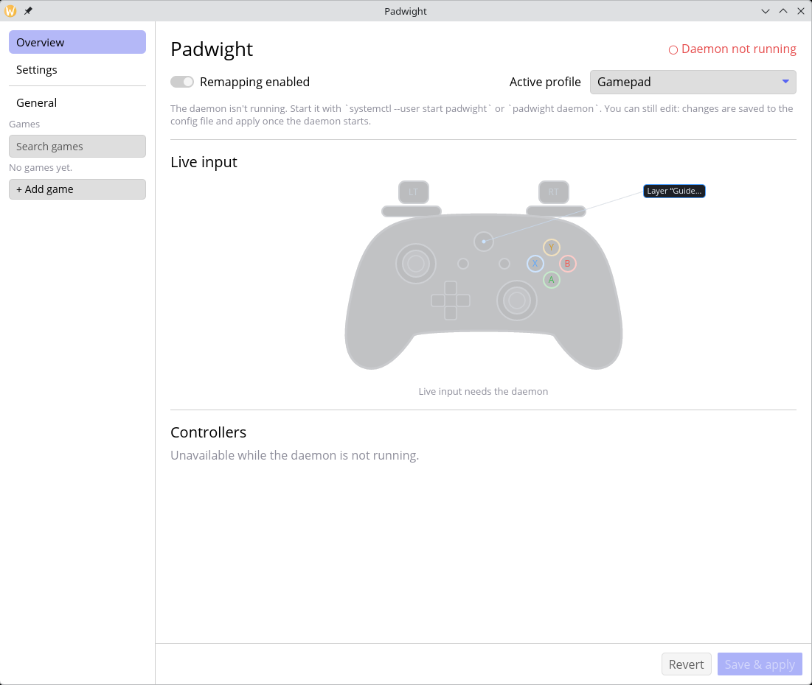
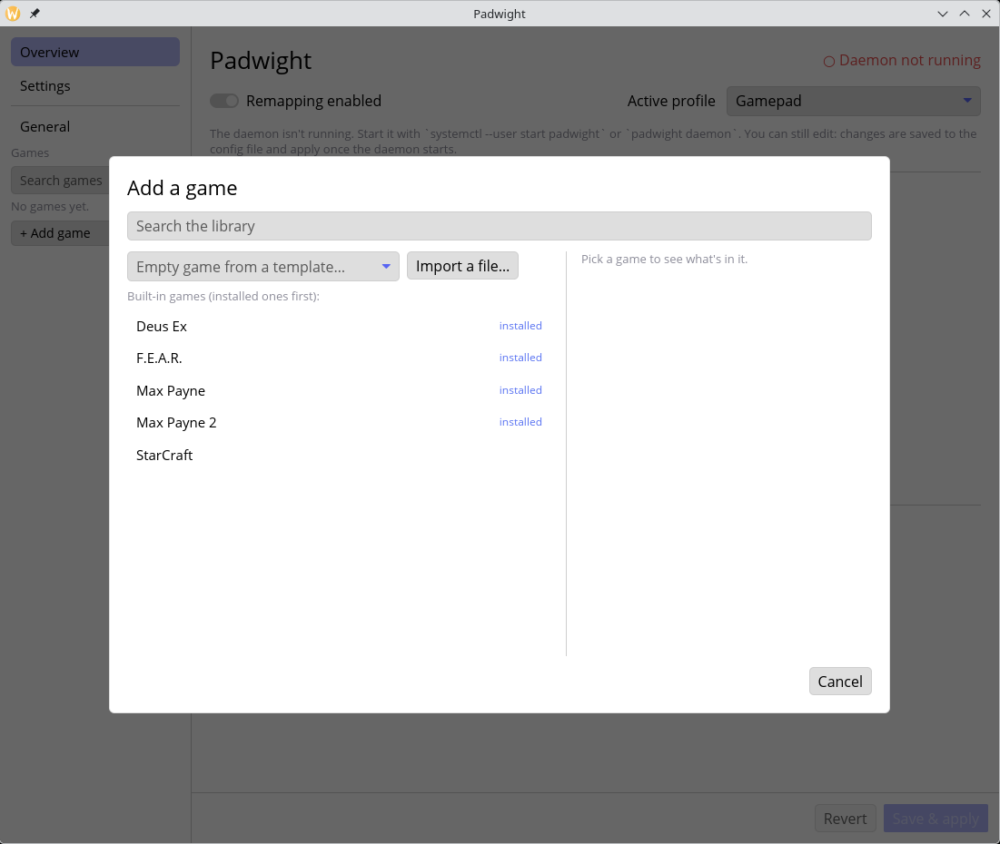
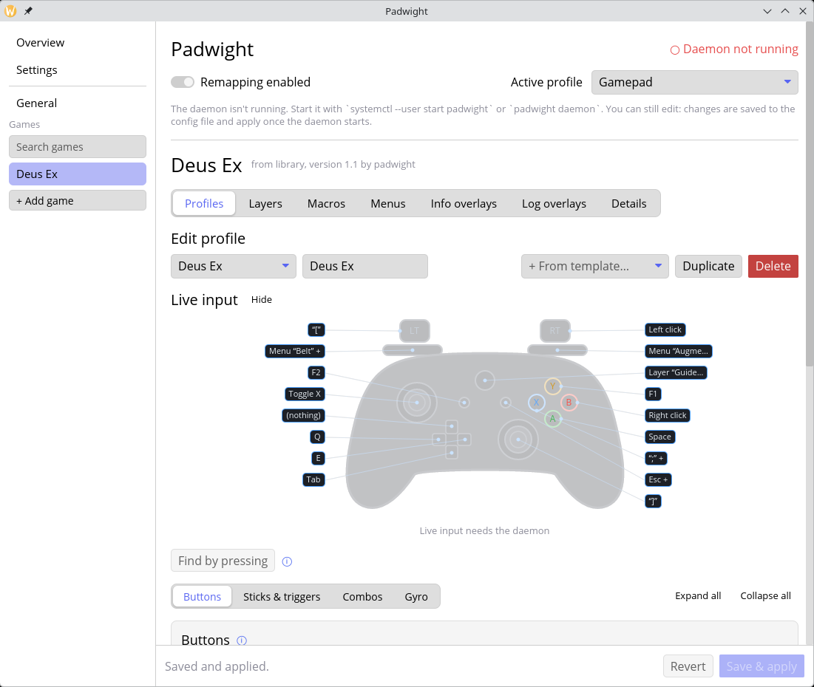
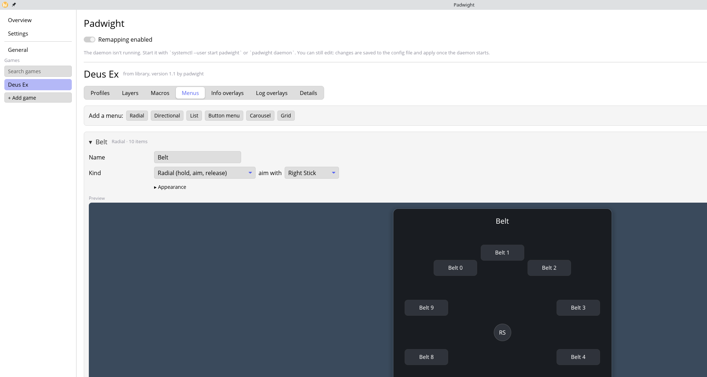
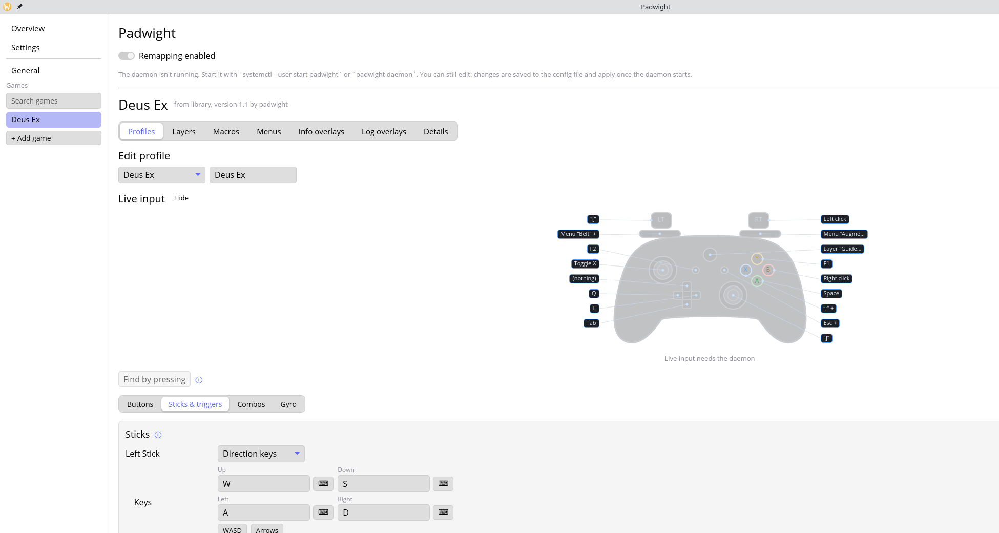
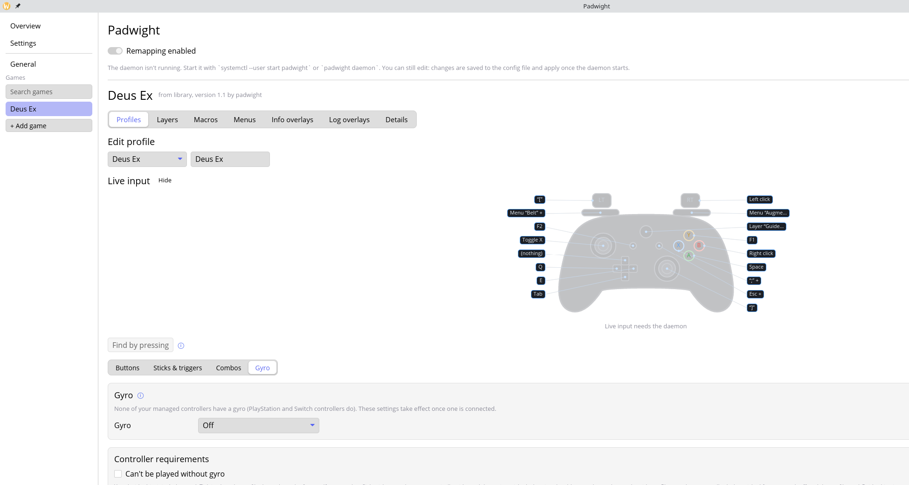
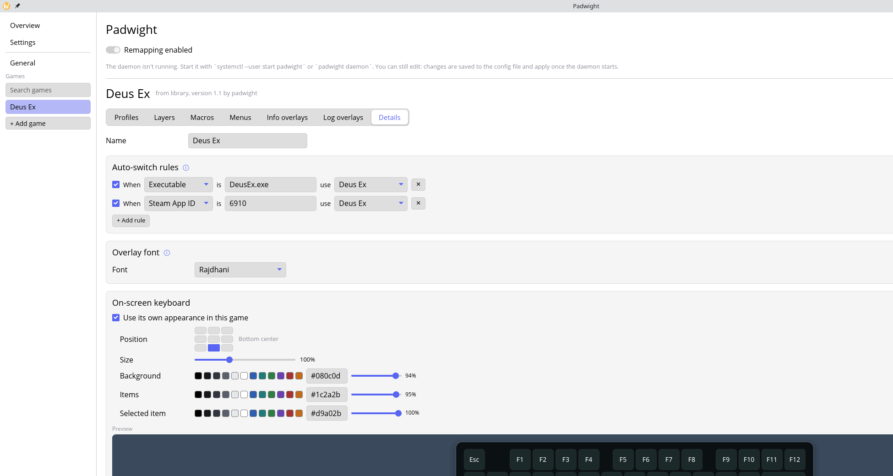

# Tutorial: making a pack, step by step (Deus Ex, Xbox-style pad)

This walks through building `packs/deus-ex.padpack`, the pack that ships with the app. You'll build it in the settings window, one input at a time, then export it. The finished file is the reference: every mapping below is in it.

The pack targets a plain **XInput** pad (an Xbox-style controller). It uses no gyro, so every profile works without one. Its one gyro-dependent profile says so.

**How to read the "why" notes.** Some notes come from what the pack or the app's code says, and some are my reading of the mapping. Where it's a reading, it's marked *(inferred)*. The pack has a description and an in-game overlay, but no design notes, so check the inferred ones against the game.

**About the screenshots.** They show the finished Deus Ex pack from the library, so each one is the end state of a step. Your own game will look emptier until you've built it. The window is shown without the daemon running, so the live controller drawing shows labels but no button presses.

## What you'll end up with

One game, **Deus Ex**, with three profiles:

| Profile | For | Needs gyro? |
|---|---|---|
| **Deus Ex** | Plain pad, mouse-look on the right stick | No |
| **Deus Ex + Gyro** | The same, plus gyro mouse aiming while you hold nothing | No (gyro is an extra) |
| **Deus Ex + Flick stick** | Right stick turns the camera in flicks; gyro aims up and down | Yes |

The game also gets two radial menus (belt and augmentations). The Guide button needs no setup: it opens the Guide overlay in every game, and the pack's Mapping guide describes the controls there.

## Before you start

1. Make sure the daemon is running (`padwight status` should list your controller). Open the settings window with `padwight`.
2. Launch Deus Ex once. Padwight needs to see the game to fill in the rule values, and the game's **Details** tab lists the windows it has seen.
3. If your controller is also visible to Steam, turn off Steam Input for it (see [Troubleshooting](https://github.com/marcinkoza0922/padwight/wiki/Troubleshooting)), or the game may see two pads.

## Step 1: Create the game

1. In the sidebar, click **+ Add game**, then pick an empty game from the picker (**Empty game from a template…**). Pick the blank option, so you start with no preset mappings.
2. Name it **Deus Ex**. The game's name becomes the pack's name when you export it.

*The picker. The dropdown at the top left holds the blank template. The list below it is the library, which is where the finished pack comes from in these screenshots.*

## Step 2: Set up the profile

Open the game's **Profiles** tab.

1. Rename the profile to **Deus Ex**.
2. Set the timing to the pack's values: **tap window 250 ms**, **long press 500 ms**. These are the defaults, and the pack writes them out explicitly.

*Why these timings (inferred):* the tap window is how long padwight waits after a tap to see whether a second tap follows. A button with a double-tap gesture holds its tap for that window, so a shorter window is snappier but makes double taps harder to land. The long press at 500 ms is long enough that a normal tap never counts as one.

**Combo window** is set to 120 ms but the pack has **no combos**. A combo makes each of its buttons wait for the rest of the combo, which delays every press. The pack avoids combos on purpose. The window does nothing here.

## Step 3: Face buttons and the D-pad

*The drawing labels each input with its action: for example "Space" on A, "Right click" on B, and `Menu "Belt" +` on LB.*

On the profile's **Buttons** sub-tab, set each button:

| Button | Action | Notes |
|---|---|---|
| **A** (South) | Keyboard **Space** | Jump. |
| **B** (East) | **Mouse Right** | "Use" in the Mapping guide. |
| **Y** (North) | Keyboard **F1** | Inventory. |
| **X** (West) | Keyboard **`;`** (`KEY_SEMICOLON`) | Reload. Gets a long-press gesture in Step 7. |
| **Select** | Keyboard **F2** | Goals. |
| **Start** | Keyboard **Esc** | Menu. Gets gestures in Step 7. |
| **D-pad Up** | **Disabled** | See below. |
| **D-pad Down** | Keyboard **Tab** | |
| **D-pad Left** | Keyboard **Q** | Lean left. |
| **D-pad Right** | Keyboard **E** | Lean right. |

**Why the less obvious ones:**

- **B = Mouse Right, not a key.** The overlay labels B as "Use," and the pack maps it to the right mouse button. The pack's description says it targets the game's default keys, so confirm in game that Use really is on the right mouse button by default.
- **D-pad Up is Disabled, on purpose.** Writing it out, instead of leaving it unset, documents the choice. D-pad Up has a job elsewhere: in the gyro profiles it's the **gyro clutch** (Step 10). Leaving it unbound in the base profile keeps it free for that.
- **Lean on Q and E.** The pack's choice. The Mapping guide labels them "Lean," so they're the keys to check first in game.

> **Known mismatch to check in game.** The Mapping guide (Step 8) shows the D-pad as "Lean" on left and right, and as "Drop / throw" on **down**. But D-pad Down is mapped to **Tab**, not a drop or throw key. Either the overlay row is wrong or the mapping is. The pack ships as is, so verify in game and fix whichever is wrong. Don't assume either.

## Step 4: The bumpers open radial menus

Bumpers hold a menu open, and the right stick chooses an item. Both menus have ten items.

*The Belt menu, expanded. The preview shows where each slot sits around the right stick, and the list under it sets each slot's key.*

1. **LB → Open menu "Belt"**, **RB → Open menu "Augmentations"** (on the Buttons tab, pick "Open menu…").
2. On the **Menus** tab, click **Add a menu** for each one:
   - **Belt**: kind **Radial**, stick **Right**. Ten items labelled `Belt 1` through `Belt 9` and `Belt 0`, with keys `1` to `9` and `0`.
   - **Augmentations**: kind **Radial**, stick **Right**. Ten items labelled `Aug F3` through `Aug F12`, with keys `F3` to `F12`.
   - Both use the default style, centered, scale 1.0.

**Why this design:**

- **Radial on the right stick.** The menu appears while the bumper is held, and the right stick aims at a slice. Letting go of the bumper picks the slice. That's a single gesture: hold, aim, release. *(The "release to choose" behaviour is in the [Menus](https://github.com/marcinkoza0922/padwight/wiki/Menus) page.)*
- **Menus are held, not toggled.** Holding the bumper keeps the menu up, and letting go closes it, so the menu can't be left open by accident.
- **The right stick is taken while a menu is open.** The controller drives the menu, and the mouse-look stops. That's expected: the menu owns the stick, and the camera doesn't move while you pick a slice.
- **Double-tap gestures on the bumpers** (Step 7) give quick actions that don't open a menu: holster on LB, and no RB gesture.

## Step 5: The sticks

*The Sticks & triggers sub-tab. The left stick is set to direction keys; the zone and the right stick settings sit below.*

### Left stick: walking and running

On the **Sticks & triggers** sub-tab, for the **left stick**:

- Action: **Keys**. Up **W**, down **S**, left **A**, right **D**.
- Deadzone **0.12**, response curve **1.0**, key threshold **0.25**.
- Add a **zone** from **0.0 to 0.6** with action **Left Shift**.

The zone is the walk/run split. While the stick is in the first 60% of its travel, Shift is held, so a light push walks and a full push runs. The Controls overlay says "Move (half push: walk)" for this reason.

**Why these values:**

- **Deadzone 0.12.** *(Inferred)* A small deadzone absorbs stick drift while keeping slow walking responsive. Larger deadzones make the first part of a light push do nothing.
- **Key threshold 0.25.** *(Inferred)* Direction keys press once the stick passes this point. A low value starts movement early. Note that the response curve (1.0 here) only affects mouse and scroll output, so it does nothing for keys.
- **Zone instead of a second binding.** Walking is one keyboard key (Shift) held by a zone, so you get walk and run from one stick with no extra button.

### Right stick: mouse look

For the **right stick**: action **Mouse**, speed **1600** px/s, deadzone **0.1**, response curve **2.0**.

- **Speed** is pixels per second at full push, so 1600 is how fast the cursor moves at full tilt.
- **Curve 2.0** is a response exponent (1.0 is linear). With an exponent above 1, small pushes move the cursor gently and full push gives full speed, which makes fine aiming possible without losing fast turns. *(The effect follows from the exponent; check the feel in game.)*
- **Deadzone 0.1** is slightly smaller than the left stick's. *(Inferred)* Aiming wants a little more precision than walking.

*You may need to adjust the speed to match the game's own sensitivity. The pack's value is what the author found, not a universal setting.*

### Stick clicks

- **Right stick click (R3)**: keyboard `]` (`KEY_RIGHTBRACE`). The overlay says "Click: laser sight."
- **Left stick click (L3)**: a **toggle** of keyboard **X**. The overlay says "Click: crouch (toggle)."

**Why L3 is a toggle (inferred):** Holding the left stick in while you also walk with it is awkward. A toggle means one click crouches and the next stands. To wrap a button's action in a toggle, pick **Toggle** on that button.

## Step 6: The triggers

Triggers are digital here: each one becomes a button once pulled past a threshold. The pack maps both to keys and mouse buttons, so they act as buttons rather than passing an analog value through.

- **Right trigger (RT)**: a button, **threshold 0.30**, action **Mouse Left** (fire).
- **Left trigger (LT)**: a button, **threshold 0.40**, action keyboard **`[`** (`KEY_LEFTBRACE`). The overlay says "Scope."

**Why the two thresholds differ (inferred):** Firing needs to respond early and repeatedly, so RT switches at 30% pull. Scope is a deliberate act, so LT needs 40%. A light brush of LT won't zoom in while you're shooting. The values are the pack's; the reasoning is my reading of them.

## Step 7: Gestures (one button, several jobs)

Gestures are per-button extra actions: double tap, triple tap and long press. Use them to give one button a second or third job without another button.

| Button | Gesture | Action | Overlay text |
|---|---|---|---|
| **X** | Long press | Keyboard `'` (`KEY_APOSTROPHE`) | "hold: change ammo" |
| **LB** | Double tap | Keyboard **Backspace** | "double tap: holster" |
| **Start** | Double tap | Numpad **+** (`KEY_KPPLUS`) | "double tap: quick save" |
| **Start** | Long press | Numpad **/** (`KEY_KPSLASH`) | "hold Start: quick load" |

**Why these:**

- **X's long press for ammo.** Reload is the common tap, and changing ammo is the rarer one. It's a long press so it can't happen by accident. *(Inferred.)*
- **LB's double tap for holster.** LB already holds the belt menu open, so a double tap is the one quick gesture that won't open the menu. Holster is a quick, deliberate action, which fits a double tap.
- **Start: save on double tap, load on long press.** Loading overwrites your current progress, so it takes the most deliberate gesture (a hold). Saving is harmless, so it gets the quick one. Both use numpad keys, which the game is unlikely to use for anything else. *(Inferred from the choice of actions.)*

> **Latency cost.** A tap on a button with a gesture waits for the tap window (250 ms) before it fires, to see whether a second tap follows. That's why reload on X feels a fraction later than a plain key would. If it bothers you, remove the long-press gesture from X, or accept the delay for the gesture.

## Step 8: The Guide button and the Mapping guide

Nothing to set up for the Guide button itself. It works the same in every game: tap it for the Guide overlay, hold it with another button for a shortcut (keyboard on X, numpad on Y, and so on). See [The Guide button](https://github.com/marcinkoza0922/padwight/wiki/Guide-Button).

The pack describes its controls in the **Mapping guide**, on the profile's **Guide** tab, which is what the overlay's Mappings box shows. The pack's texts for each input are there, with the Lean row shared by both D-pad sides, and the gesture texts (holster, quick save, quick load) under their gestures. Check them in game like everything else. The Mapping guide follows the profile's mappings, so a row whose text you haven't written still shows what its action does.

The pack used to have a separate Controls info overlay that Guide opened. It's gone, and the Mapping guide replaces it.

## Step 9: Check every input in the game

Before you go further, test the mapping in the game:

1. Watch the live controller drawing in the profile editor, or use **Find by pressing** there. Press each button and confirm it shows the right action.
2. Walk and run: a light push walks, a full push runs.
3. Aim: check that the right stick moves the view at a comfortable speed.
4. Fire and scope: RT fires, LT scopes.
5. Menus: hold LB and RB, aim, and release. Check the slice you pick.
6. Gestures: double tap LB, double tap Start, long press Start, and long press X.
7. Guide: tap it to open the Guide overlay and check its mappings. Then hold Guide and press Y for the numpad, and tap Guide and open the Steam overlay from its menu, if Steam is running.

If something doesn't work, check the rule first (is the executable right?), then the profile is active (the Overview shows which), and then the mapping.

## Step 10: The gyro profile: "Deus Ex + Gyro"

*The base profile's Gyro tab, with gyro off. The steps below set these controls on the copy.*

Gyro is an extra here. The profile works without it, so it doesn't need the requirement.

1. On the **Profiles** tab, duplicate the **Deus Ex** profile, and rename the copy to **Deus Ex + Gyro**.
2. On its **Gyro** tab:
   - **Mode**: mouse, sensitivity **15.0** (pixels per degree turned).
   - **Horizontal**: yaw (turn the controller left and right like a flashlight).
   - **Activation**: **unless held**, with **D-pad Up** as the clutch.
   - **Noise threshold**: 1.0 degree/second.
3. Leave **Can't be played without gyro** unticked.

**Why these gyro choices:**

- **Mouse mode.** Turning the controller moves the cursor, which adds fine aiming on top of the right stick. That's what the mouse mode does.
- **Unless held, D-pad Up.** This is a *clutch*: while D-pad Up is held, gyro is off. That lets you move the controller to a comfortable position without the aim jumping. D-pad Up is free in this profile for that reason (Step 3).
- **Not required.** The profile is fully usable with the right stick alone. Gyro is extra precision, so a player without gyro is still offered this profile. The pack's rule is to mark `requires` only when a profile can't be played without the feature.

## Step 11: The flick stick profile: "Deus Ex + Flick stick"

A flick stick turns the camera by flicking the right stick, instead of holding it over to aim. It's quicker for turning round, but it only turns left and right. Looking up and down needs gyro, which is why this profile **requires** gyro.

1. Duplicate the **Deus Ex + Gyro** profile, and rename the copy to **Deus Ex + Flick stick**.
2. On its **Sticks & triggers** tab, set the **right stick** action to **Flick stick**:
   - **Turn size**: **8000** px for one full turn. Use **Test turn** (it moves the mouse one turn after 3 seconds) to check how far the camera turns in the game, and adjust until a full turn matches.
   - **Flick threshold**: **0.9**. The deflection at which a flick starts.
   - **Flick time**: **100 ms**. The initial turn is spread over this time.
   - **Turning smoothing**: **0 ms** (off).
   - **Forward deadzone**: **0°**. The angle either side of straight up in which a flick turns nothing.
   - **Vertical**: off. Gyro handles up and down (below).
3. On its **Gyro** tab: sensitivity **22.0** (the pack's value, above the gyro profile's 15), yaw, unless held on **D-pad Up**.
4. Tick **Can't be played without gyro**.

**Why these choices:**

- **Requires gyro.** In this profile the right stick flicks left and right, and gyro does the up-and-down aim. Without gyro there's no vertical aim, so the profile can't be played as written. That's the test for `requires`. (The app's flick notes mention the other stick as an alternative, but this profile doesn't set one up.)
- **Flick threshold 0.9.** *(Inferred)* A high threshold stops a casual push from turning the camera. Only a hard push flicks, so you can still nudge the stick for small movements.
- **Flick time 100 ms and smoothing off.** The flick should land quickly and stop cleanly. Smoothing would make the turn drift on after you let go. *(Inferred.)*
- **Yaw is still on.** The pack keeps horizontal gyro on, so turning the controller also adds some horizontal turn. I haven't verified how that combines with a flick. If it fights the flick in game, try roll (tilt) for horizontal, or lower the sensitivity.

> **Calibration.** Turn size is the one value that depends on your game settings. Set it with Test turn, and expect to change it if you change the game's sensitivity.

## Step 12: Describe the pack and export it

*The Details tab. The auto-switch rules are what Padwight matched when you launched the game in "Before you start".*

1. Open the game's **Details** tab.
2. Fill in:
   - **Author**: your name.
   - **Version**: `1.0` for a first release. Later, bump it. Versions compare number by number (`1.10` is newer than `1.9`), and a higher version gives installed copies the Update badge.
   - **Description**: what the pack does and how it's laid out. The pack's own description is: "The original Deus Ex (2000) on an Xbox-style pad, for the game's default keys…"
   - **Made with**: "Xbox controller".
3. Click **Export…**. The dialog lists the rules, the profiles' declared requirements (the flick profile declares gyro), and any dangling references (a button pointing at a missing macro or menu). Fix any warnings before saving.
4. Save as `deus-ex.padpack`.
5. Click **Save & apply** to remember the export details in the game.

### Test the export by importing it

1. In the sidebar, click **+ Add game**, then **Import a file…**, and choose the file.
2. The preview shows the contents, your controller's gaps (on a plain pad, the flick profile is not offered), and any clashes. Since you already have a Deus Ex game, the preview asks you to rename or replace. Use **Rename** to test, then delete the test copy.

## Step 13 (maintainers): add it to the library

The library is the set of packs that ship with the app, in `packs/`.

1. In a debug build, tick **Library pack** on export, so the game keeps its library ID and installed copies get it as an update.
2. Copy the file into `packs/`, and run `cargo test`. The tests check the format, IDs, names, references, that a rule points at an existing profile, and that at least one profile works on a plain pad.
3. Rebuild. The build embeds every `.padpack` in `packs/` into the binary. Developers can find the details in the [architecture notes](https://github.com/marcinkoza0922/padwight/blob/main/docs/development/architecture.md).

## Summary: the less obvious choices

| Choice | Why |
|---|---|
| Tap window 250 ms, no combos | Combos delay every member press. The Guide shortcuts don't need them. |
| D-pad Up disabled | Reserved for the gyro clutch in the gyro profiles. |
| Lean on Q / E | Keeps the left thumb on the stick; the overlay names them "Lean." *(Inferred.)* |
| Mouse right for Use | Overlay says Use; the pack maps it to the right mouse button. Confirm in game. |
| Radial menus on the right stick, held by the bumpers | One gesture: hold, aim, release. Aiming needs no extra button. |
| Walk via a Shift zone on the left stick | Walk and run from one stick without a second button. |
| Mouse speed 1600, curve 2.0 | Squared response: fine aim at small pushes, fast turns at full push. |
| RT at 0.30, LT at 0.40 | Firing responds early; scope needs a deliberate pull. *(Inferred.)* |
| X long press for ammo | The rarer action takes the deliberate gesture. *(Inferred.)* |
| Start: Esc, double tap save, long press load | Loading overwrites progress, so it takes the hardest gesture. *(Inferred.)* |
| Guide opens the overlay, not the game | Guide + A doesn't jump while you're in the keyboard. Steam's overlay is in the Guide menu. |
| Gyro as an extra, not required | The profile works without gyro; only the flick profile needs it. |
| Flick profile requires gyro | Flick turns horizontally only, and in this profile gyro does the up-and-down aim. |

## Troubleshooting

- **The rule doesn't switch to the profile.** Check the executable name (for Proton games, the Windows `.exe`, e.g. `DeusEx.exe`) and the Steam App ID. The **Details** tab's recently focused windows show what padwight saw.
- **The game sees two controllers.** Turn off Steam Input for the pad, or set `SDL_JOYSTICK_HIDAPI=0` (see [Troubleshooting](https://github.com/marcinkoza0922/padwight/wiki/Troubleshooting)).
- **A button feels late.** It has a gesture, so it waits for the tap window. See the latency note in Step 7.
- **Guide's shortcuts don't work.** Hold Guide and press the shortcut, or tap Guide to open the overlay and then press it. See [The Guide button](https://github.com/marcinkoza0922/padwight/wiki/Guide-Button).
- **A row in the Mapping guide reads wrong.** The pack's texts are copies of the old Controls overlay. Fix the text on the **Guide** tab.
- **The flick profile is missing.** It needs gyro, so with a plain pad it isn't offered. The import preview lists profiles it won't offer.
